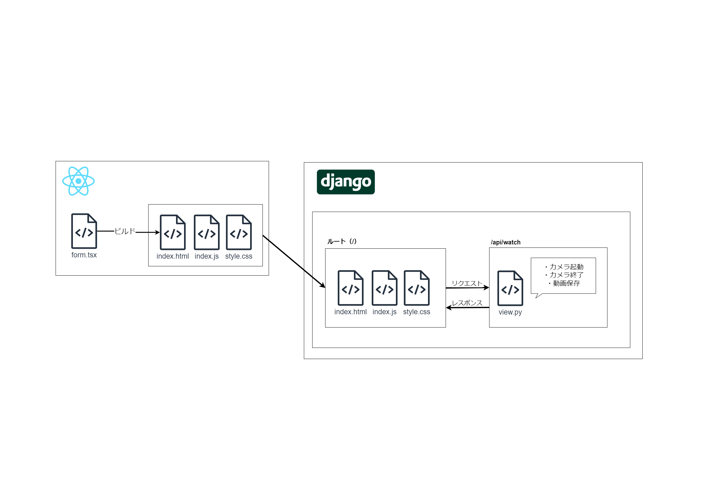

# 監視カメラ

## Important!!
[this](https://www.ultra-noob.com/blog/2020/164/)

## 概要図



## 起動方法

1. このコミットを clone、もしくはダウンロード
2. ローカルに venv 環境を作成し、requirements.txt の内容をインストール

```
pip install -r requirements.txt
```

3. python-opencv や django がインストールされているか確認

```
pip list
```

4. django のサーバーを起動

```
# manage.pyがある場所まで移動
cd kanshiKamera

# サーバー起動
python manage.py runserver
```

5. http://localhost:8000/watch/ にアクセス
6. 動画の撮影を開始。「q」ボタンで終了。
7. 撮影した動画は「/videos」の中に格納される。

## -- 個人用メモ --

### How to create Form

1. write models.py
2. write form to templates/{projectname}/index.html
3. write view
4. put command to create migration file

```
python manage.py makemigrations nice
```

5. put command to migrate

```
python manage.py migrate
```

6. sqlite3 install & check move
7. enjoy!

### How to Migration

1. write models.py
2. put command to create migration file(auto create migrations/0001_initial.py)

```
python manage.py makemigrations nice
```

3. put command to migrate(auto create to sqlite table from 0001_initial.py)

```
python manage.py migrate
```
